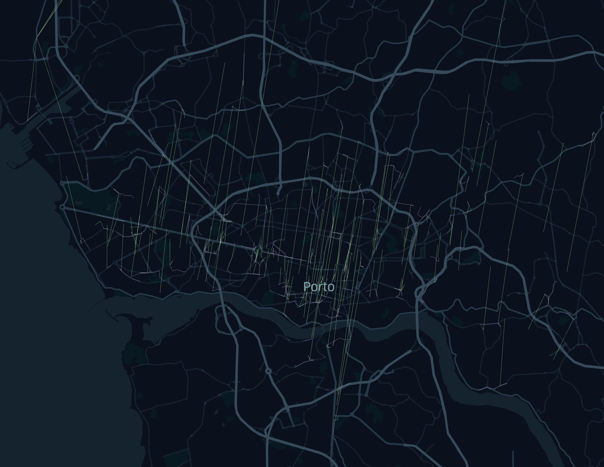
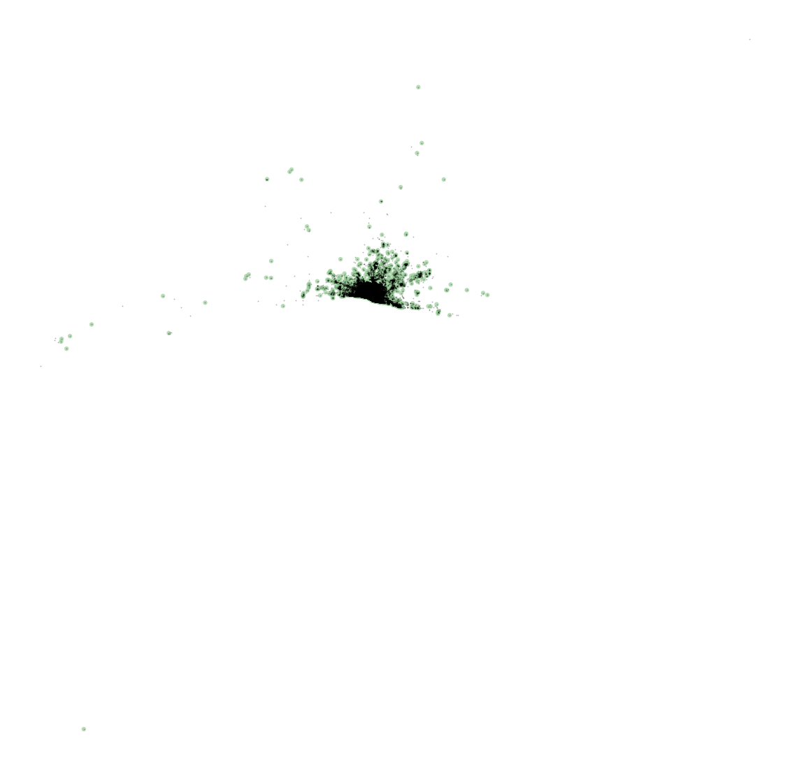
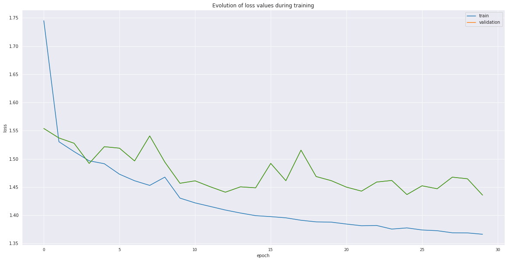
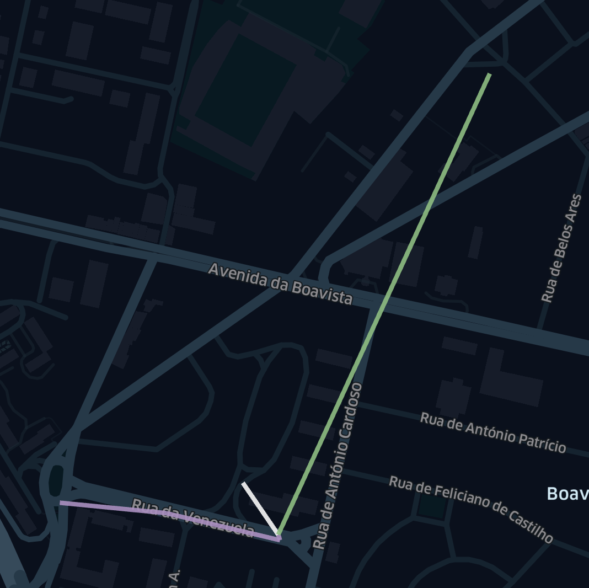
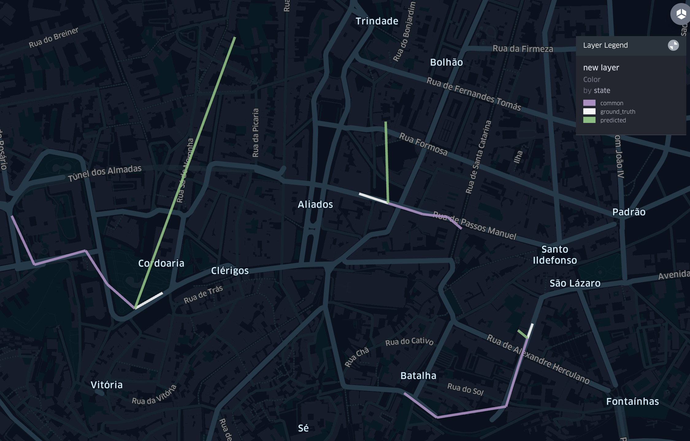

### Prediction of Vehical Destination In Porto

  
The purpose of this notebook is to guide anyone that has a geocoded dataset of assets (that has 'origin-destination' nature) and wants to make geospatial predictions with it. These two notebooks will provide data formatting, feature engineering, modelling that are relevent to the task and is aimed to help anyone who doesn't have in-depth experience with geospatial analytics. An interactive HTML file also is supplied visualize the data and represent predictions.

### Problem Definition

The task is to predict the trajectory of vehicles. The dataset comes from the ECML PKDD. The dataset contains 1710670 records of vehicle movement. Movement is expressed in a 'Polyline' geometry. We will parse these Polyline geometries to extract features. The dataset also contains various metadata regarding the vehicels and timestamps (as is the case for most geospatial data) which we'll drive features from.

  

### Features

The metadata regarding vehicle ids is categorical data. We treat the ids as integers (replace the vehical ids with integer values). Similar operations are done to every categorical variable (the type of day - a weekend, weekday, holiday to 0, 1, 2, etc.)

Timestamps are converted into three different categorical features, i.e., week of the year, day of week and quarter-hour of day. Locational information is also a part of feature extraction. 

The over 1.5 million records are clustered using the mean shift algorithm. Sampling the data, and using this sample to determine the bandwidth and the clusters are the methods followed to obtain the clusters. Below you can see the data points imposed on the cluster centers.

  

Apart from the destination of these trips (which are the targets), the rest of the polyline geometries are used in the following way, the first and last 5 points of the sequence (of the vehicles' trips ) are used as features of the model. 
  

### Modelling

The model uses 7 separate embedding layers to encode the 7 fields of metadata (head of the data frame can be seen in the notebook). The 20 values (10 lat, 10 lng values of the first and last 5 points in the sequence) are fed into a dense layer with an output of a single node. The output of the 7 embedding layers (which embed to a fixed vector space of 10) and the positional DNN are then fed into a feed-forward DNN of output 512 (relu). Then that output is fed into a softmax DNN (with output size of how many clusters there are). 

This outputs a probability vector. This vector is multiplied with their respective cluster centers (taken a weighted average). This is the 'prediction' of the model.

This system is trained on the haversine distance as a loss function. The difference between the prediction and the ground truth are based on this metric. Below one can see the training and validation loss vs epochs. The random guess (beginning of epoch one, random weights) suggests an average haversine distance of 7 Km.

### Predictions

Below one can see the predictions of a subset of the validation set. Purple lines (common) indicate the last 5 points before the destination. The white lines (ground_truth) shows the true destination, whereas the green line indicates the predicted points.

Places outside of the city centers seem to have poor performance while the city has very decent predictions given the simplicity of the model.

Please find the interactive HTML file in the repo containing the visualization of the subset of the validation set.  
